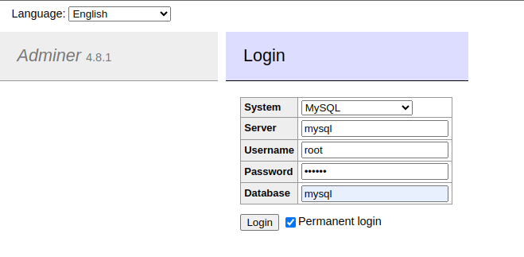

# React.js + Symfony + MySQL Application

This project is a full-stack web application developed with React.js for the frontend, Symfony for the backend, and MySQL as the database. The development environment is managed using Docker Compose.

## Prerequisites

Make sure you have Docker and Docker Compose installed on your machine. You can download them from [the official Docker website](https://www.docker.com/).

## Configuration

1. Clone this repository on your local machine:

   ```bash
   git clone git@github.com:Pixeloceax/docker-compose-react-symfony.git
   cd docker-compose-react-symfony
   ```

2. Create a `.env` file at the root of the project and configure the necessary environment variables.

3. Build Docker images and launch containers:

   ```bash
   docker-compose up -d --build
   ```

4. Access the frontend at [http://localhost:3000](http://localhost:3000) and the backend at [http://localhost:8000](http://localhost:8000).

### Configuration Files

- [Dockerfile for Frontend](./frontend/harmonyheaven/Dockerfile)
- [Dockerfile for Backend](./backend/harmonyheaven/Dockerfile)
- [Docker Compose Configuration](./docker-compose.yml)

## Stopping the Application

To stop Docker containers, use the following command:

```bash
docker-compose down
```

## Development

Frontend source code is located in the frontend/ directory.
Symfony backend source code is located in the backend/ directory.

## MySQL Database

Database connection information for MySQL can be configured in the .env file. You can use a database management tool such as phpMyAdmin by accessing http://localhost:8080 (default credentials in the .env file).

## Adminer

Adminer is a web-based database management tool. It allows you to easily manage your databases visually. You can access it at http://localhost:8080 (default credentials in the docker compose file).



|          |                                                             |
| -------- | ----------------------------------------------------------- |
| System   | _YOUR DATABASE_                                             |
| Server   | _YOUR DOCKER IMAGE_                                         |
| Username | _YOUR DATABASE USER (DEFAULT ROOT)_                         |
| Password | _YOUR DATABASE PASSWORD (DEFAULT 123456)_                   |
| Database | _YOUR WORKING DATABASE (LEAVE EMPTY IF YOU DON'T HAVE ONE)_ |

##

Feel free to customize this README based on your project's specifics and the information you want to provide to the repository users.
